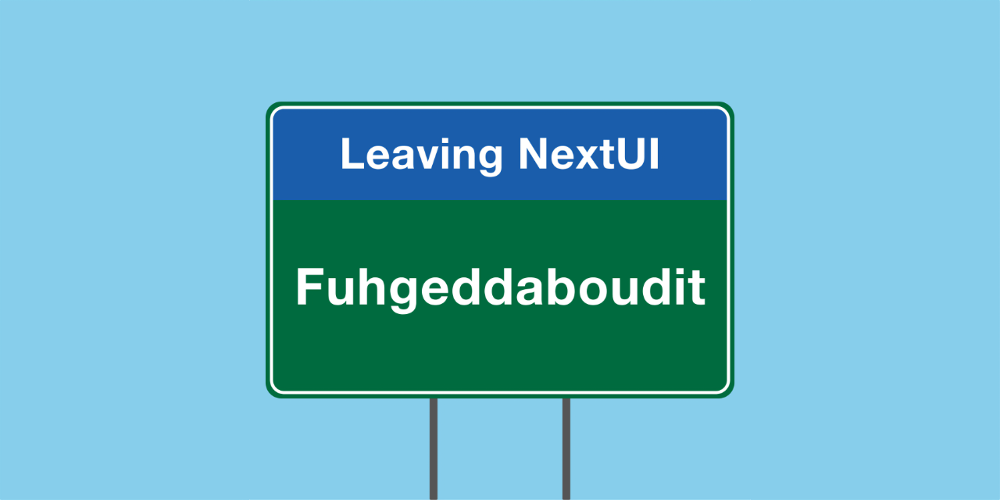
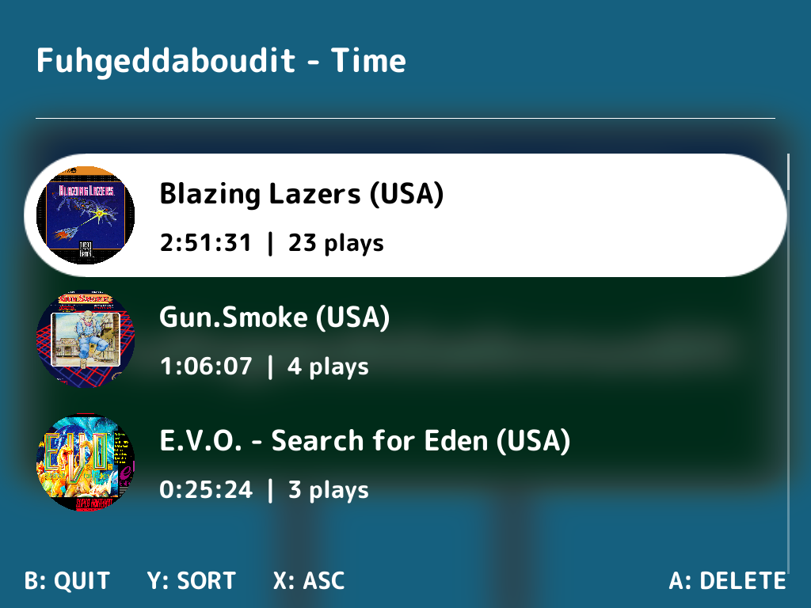
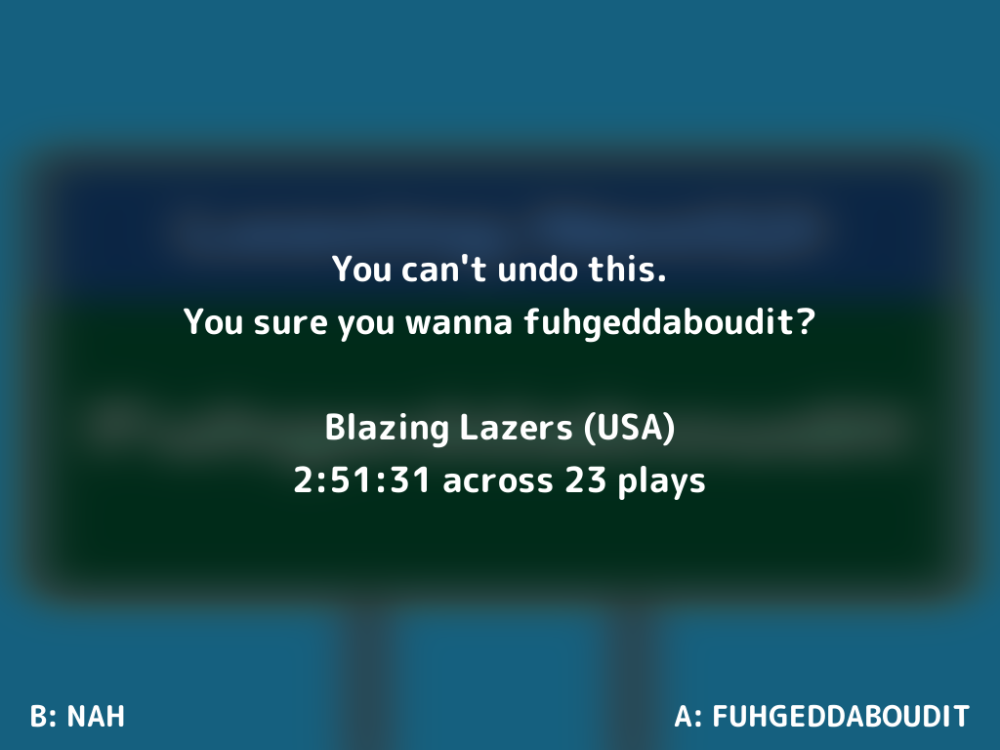
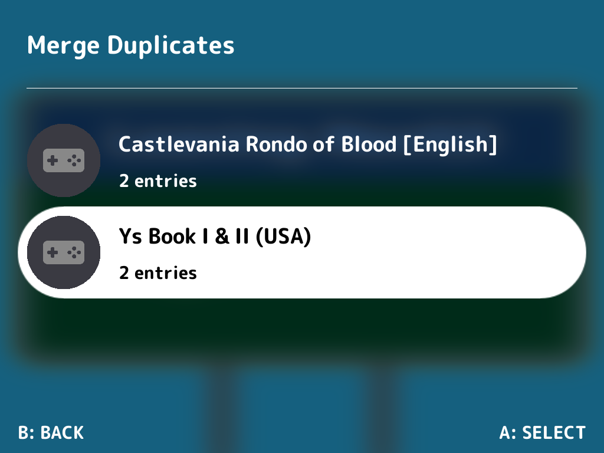
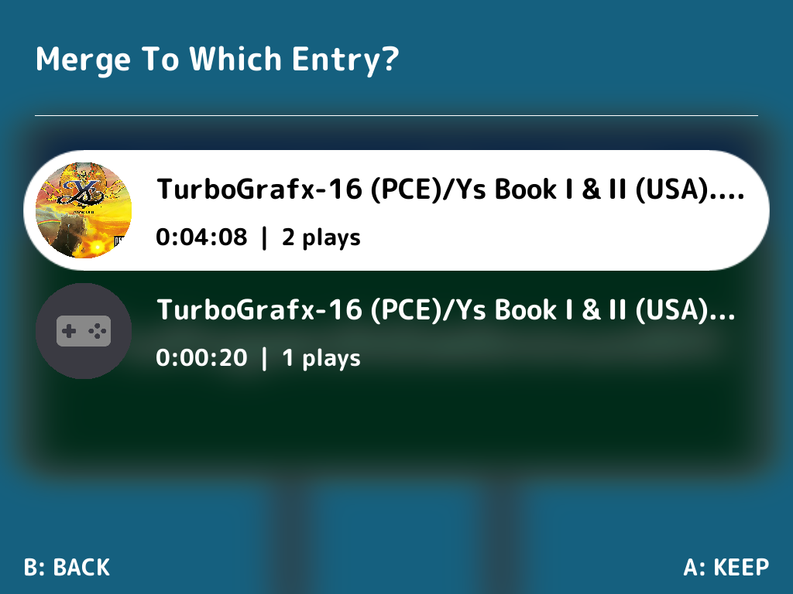

<div align="center">

# Fuhgeddaboudit



[](https://github.com/ericreinsmidt/nextui-fuhgeddaboudit/releases)
[](https://github.com/ericreinsmidt/nextui-fuhgeddaboudit/releases)
[](LICENSE)

Merge duplicate entries or remove individual game stats from the NextUI Game Tracker for TrimUI Brick, Brick Hammer, and Smart Pro. Have too many games being tracked you don't want to scroll through? Select one you don't want and fuhgeddaboudit!

</div>

## Screenshots

<p align="center">
  
  
  
  
</p>

## Features

- **Game list with thumbnails** — Browse all tracked games with box art, total play time, and play count
- **Sort options** — Sort by time played, name, or number of plays in ascending or descending order
- **Confirmation before deletion** — No accidental deletions; confirm before you fuhgeddaboudit
- **Clean database removal** — Deletes both play activity records and the rom entry from the tracker
- **Merge duplicates** — Detect and merge duplicate entries, combining play stats into a single entry

## Install

### NextUI Pak Store

Fuhgeddaboudit is available in the [NextUI Pak Store](https://github.com/NextUI-Paks). Install it directly from the store on your device.

### Manual

1. Download `Fuhgeddaboudit.tg5040.pak.zip` from the [latest release](https://github.com/ericreinsmidt/nextui-fuhgeddaboudit/releases/latest)
2. Extract and copy the `Fuhgeddaboudit.pak` folder to `/Tools` on your SD card
3. Launch from the Tools menu in NextUI

## Controls

| Button | Action |
|--------|--------|
| D-pad  | Navigate game list |
| A      | Delete selected game |
| Y      | Cycle sort mode (Time / Name / Plays) |
| X      | Toggle sort direction (ASC / DESC) |
| ∴      | Merge duplicate entries |
| B      | Quit |

## Building

Requires the [tg5040 Docker toolchain](https://ghcr.io/loveretro/tg5040-toolchain):

```sh
make build    # cross-compile via Docker
make package  # create distributable zip
```

## License

MIT
